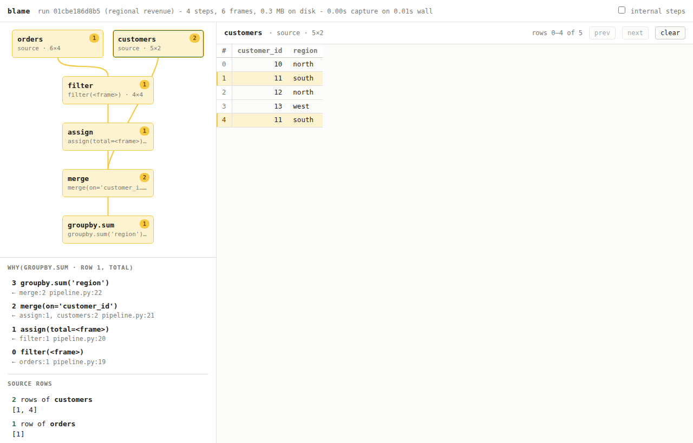

# blame

**Cell-level "why" for pandas pipelines. No code changes.**

Your report says `revenue = 41,900` and it should say `38,400`. Today you find out
by inserting print statements down a thirty-step pipeline until something looks
wrong. `blame` records the pipeline as it runs and lets you ask the question
directly.

```python
import blame, pandas as pd

with blame.trace():
    orders    = pd.read_csv("orders.csv")
    customers = pd.read_csv("customers.csv")
    clean     = orders[orders.qty > 0]
    clean     = clean.assign(total=clean.qty * clean.price)
    joined    = clean.merge(customers, on="customer_id")
    report    = joined.groupby("region", as_index=False)["total"].sum()

run = blame.last_run()
print(run.why(row=1, col="total"))
```

The `south` row of the report says `50.0` and should say `25.0`:

```
why(groupby.sum [f8], row [1], column 'total')

  derivation:
    step   6 groupby.sum('region') [demo.py:9] <- f7:2 rows
    step   5 merge(on='customer_id') [demo.py:8] <- f6:1 row, f1:2 rows
    step   4 assign(total=<frame>) [demo.py:7] <- f3:1 row
    step   1 filter(<frame>) [demo.py:6] <- f0:1 row

  source rows:
    read_csv('customers.csv') [f1]: 2 row(s) -> [1, 4]
    read_csv('orders.csv') [f0]: 1 row(s) -> [1]
```

One order row, but **two** customer rows — `customers.csv` has `customer_id 11`
twice, so the merge duplicated that order and the group-by added it up twice.
The answer is two row numbers in two files, not "somewhere in these steps".

## Or point at it

```bash
blame ui
```



The pipeline on the left, the data on the right. Click the cell that is wrong
and every frame that touched it lights up with the number of rows it
contributed; frames that had nothing to do with it grey out. Click any frame in
the graph to see those rows in it — here, `customers` rows 1 and 4, the same
`customer_id` twice. The address bar carries the selection, so a link to one
cell's explanation can go straight into a code review.

## Install

Not on PyPI yet — the `blame` name needs to be checked and claimed before v0.1
ships.

```bash
git clone <this repo> && cd blame
uv venv && uv pip install -e ".[dev]"
```

## What you get

| Question | Call |
|---|---|
| Which source rows produced this cell? | `run.why(row=2, col="total")` |
| Where did this input row end up? | `run.forward(row=17)` |
| What did the pipeline actually do? | `run.table()` |
| What did the data look like at step 12? | `run.at(12)` |
| All of the above, by clicking | `run.ui()` or `blame ui` |

Nothing in your pipeline changes. `blame` wraps pandas while the trace is
active and restores it afterwards; your code returns exactly the objects it
returned before.

## What it costs

Measured on this machine (`python bench/overhead.py`), an 11-step pipeline —
filter, assign, dropna, merge, sort, drop_duplicates, two-key group-by:

| input rows | untraced | traced | overhead | trace on disk | `why()` |
|---|---|---|---|---|---|
| 10,000 | 0.005s | 0.026s | 4.9x | 0.9 MB | 2 ms |
| 100,000 | 0.023s | 0.059s | 2.6x | 8.9 MB | 3 ms |
| 1,000,000 | 0.228s | 0.467s | 2.1x | 88 MB | 11 ms |

Most of that is a fixed price paid once for writing your input frames, not a
per-step tax. Chaining more operations over the same million rows costs about
**18 ms per step** and the ratio stays flat (`python bench/scaling.py`):

| steps | untraced | traced | overhead |
|---|---|---|---|
| 4 | 0.108s | 0.303s | 2.8x |
| 8 | 0.145s | 0.446s | 3.1x |
| 16 | 0.233s | 0.725s | 3.1x |
| 32 | 0.456s | 1.346s | 3.0x |

Traces are written uncompressed because a local debugging cache is bound by
write time, not disk: zstd shrinks an int64 column 2.3x but takes 14x longer to
write it. Pass `compression="zstd"` or `"lz4"` if you would rather have the
space, and `sample_rows=N` to cap how much of very large frames gets stored
(lineage stays exact either way).

## How it works

Every traced operation stores a **lineage vector** — a compact array mapping
output rows back to input rows. Filters store the selection; joins store the
matched row pairs on both sides; group-bys store the group membership in CSR
layout. Answering `why` is then a walk backwards through those arrays, which is
array indexing rather than recomputation.

Intermediate frames are written to `.blame/` one column at a time, each
addressed by the hash of its contents. Most columns are never written at all: a
filtered, sorted or joined column is its parent's column seen through a row
mapping, so `blame` stores a *reference* to the parent plus the mapping it
already recorded, and rebuilds the column by indexing when you ask to see it.
Only two kinds of bytes are ever stored — your input frames, and columns whose
values are genuinely new (`assign`, aggregations).

## Honesty about accuracy

Lineage is **exact** for filters, slices, sorts, joins, group-bys, concats,
column projections and the row-preserving transforms (`assign`, `rename`,
`astype`, `fillna`, ...).

It is **approximate** in two situations, and says so in both:

*An opaque user function* — `apply`, `map`, `transform` with a lambda. `blame`
assumes row identity and marks the step `~`.

*An operation `blame` does not cover* — `pivot_table`, `unstack`, `melt` and
friends. pandas tells us it derived one frame from another, so rather than
letting the intermediate pose as a pipeline input, `blame` inserts an explicit
step and widens the answer to every candidate row:

```
    step   5 <untraced unstack>() [pipeline.py:7] <- f5:4 rows  ~approximate
```

Either way `run.table()` shows a `~`, `why()` prints a warning banner, and
`Explanation.approximate` is `True`. The chain still runs all the way back to
your real source files — it is widened, never truncated, and never presented as
exact.

## Try it

```bash
git clone <this repo> && cd blame
uv venv && uv pip install -e ".[dev]"
python examples/pipeline.py      # a pipeline with a planted double-counting bug
blame steps                      # what it did
blame why 1 --col total --show 5 # why the "south" total is wrong
blame ui                         # the same answer, by clicking
pytest -q                        # 29 tests, ground-truth checked
```

## Status

v0.1 is the tracer, the store and the query API for pandas, with a CLI; v0.3
is the page above. `blame diff run1 run2`, column-level `why`, and polars are
next — see `ROADMAP.md`, which also lists what is known not to work.
